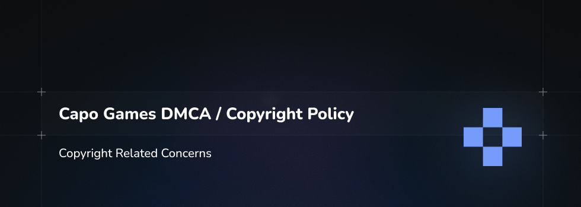

# Rhythia Copyright & DMCA Policy

This document explains how Rhythia handles copyright and copyright infringement claims for the game, related web services, and associated infrastructure (including Rhythia’s GitHub repositories).

---

## 1. Community-Driven Content

Rhythia is a heavily community-oriented game. All game levels (beatmaps) are **created and uploaded by community members**, and in some cases, permission from the relevant copyright holders may not have been correctly obtained.

To minimise risk and act responsibly:

- We do **not** actively advertise or directly profit from user-uploaded content.
- A significant portion of donations or revenue is used to **reinvest in music licensing** and related rights.

For licensing enquiries (for example, if you would like to work with us to license music for use in Rhythia), please contact:

- **Email:** `rhythiaa@gmail.com`

---

## 2. Legal Framework (DMCA)

Rhythia has adopted the following policy concerning copyright infringement in accordance with the **Digital Millennium Copyright Act (DMCA), 17 U.S.C. § 512**.

The contact information for Rhythia’s **Designated Agent to Receive Notification of Claimed Infringement (“Designated Agent”)** is listed at the end of this policy and is on file with the United States Copyright Office.

Rhythia takes copyright and other intellectual property rights very seriously. It is Rhythia’s policy to:

1. **Expeditiously block access to or remove content** that it believes in good faith may contain material that infringes the copyrights of third parties; and
2. **Remove and discontinue service to repeat offenders** in appropriate circumstances.

This policy applies to content hosted or referenced by Rhythia’s services, including but not limited to:

- The Rhythia game and related servers
- Rhythia websites and web APIs
- Rhythia-managed GitHub repositories and associated content

---

## 3. Reporting Copyright Infringements

If you believe that content residing on or accessible through any Rhythia website, service, or repository infringes your copyright, you may send a **DMCA notice of claimed infringement** to the Designated Agent containing the information below.

(You may wish to consult legal counsel or refer directly to 17 U.S.C. § 512(c) to confirm these requirements.)

Your notice should include:

1. **Signature**  
   A physical or electronic signature of a person authorised to act on behalf of the owner of the copyright that has been allegedly infringed.

2. **Identification of the copyrighted work(s)**  
   Identification of the copyrighted work(s) claimed to have been infringed, or, if multiple copyrighted works at a single online site are covered by a single notification, a representative list of such works.

3. **Identification of infringing material**  
   Identification of the material that is claimed to be infringing or to be the subject of infringing activity and that is to be removed or access to which is to be disabled, and information reasonably sufficient to permit Rhythia to locate the material (for example, URLs or in-game identifiers).

4. **Contact information**  
   Information reasonably sufficient to allow Rhythia to contact you, such as a postal address, telephone number, and (if available) an e-mail address.

5. **Good-faith statement**  
   A statement that you have a good faith belief that use of the material in the manner complained of is **not authorised** by the copyright owner, its agent, or the law.

6. **Accuracy and authority statement**  
   A statement that the information in the notification is accurate and, **under penalty of perjury**, that you are authorised to act on behalf of the owner of the copyright that is allegedly infringed.

---

## 4. What Rhythia Does When It Receives a Notice

Once a complete and proper notice of claimed copyright infringement is received by the Designated Agent, or if Rhythia otherwise comes to believe in good faith that content on the Rhythia service may contain infringing material, it is Rhythia’s policy to:

1. **Remove or disable access** to the content identified in the notice of claimed infringement.
2. **Notify the content provider, member, or user** that the content has been removed or access has been disabled.
3. **Terminate, in appropriate circumstances, subscribers and account holders who are repeat infringers.**

---

## 5. Submitting Counter-Notices

If you are a content provider, member, or user and you believe that your content was removed or disabled by mistake or misidentification, or you believe you have the right to post and use such content (for example, with permission from the copyright owner, its agent, or pursuant to the law), you may send a **counter-notice** to the Designated Agent containing the following:

1. **Signature**  
   A physical or electronic signature of the content provider, member, or user.

2. **Identification of the content**  
   Identification of the content that has been removed or to which access has been disabled, and the location at which the material appeared before it was removed or access to it was disabled (for example, the exact URL or in-game reference).

3. **Good-faith statement**  
   A statement, under penalty of perjury, that the content provider, member, or user has a good faith belief that the material was removed or disabled as a result of mistake or misidentification of the material to be removed or disabled.

4. **Contact and jurisdiction statement**  
   The content provider’s, member’s or user’s name, address, telephone number, and (if available) e-mail address, and a statement that such person or entity consents to the jurisdiction of the **Federal District Court for the judicial district** in which their address is located, or, if the address is located outside the United States, for **Los Angeles County, California**, and that such person or entity will accept service of process from the person who provided the original notification of the alleged infringement or that person’s agent.

---

## 6. After a Counter-Notice Is Received

If a valid counter-notice is received by the Designated Agent, Rhythia may:

1. Send a copy of the counter-notice to the original complaining party, informing them that Rhythia may replace the removed content or cease disabling access to it in **10 business days**; and
2. Unless the copyright owner files an action seeking a court order against the content provider, member, or user, Rhythia may, in its sole discretion, **restore the content or access to it in 10 to 14 business days or more** after receipt of the counter-notice.

The precise handling and timeline may vary and remains at Rhythia’s sole discretion, consistent with applicable law.

---

## 7. Designated Agent Contact Details

Please direct DMCA notices and counter-notices to:

- **Email:** `rhythiaa@gmail.com`  
  (48-hour response guaranteed)

When contacting us, please clearly label your message as a **DMCA Notice** or **DMCA Counter-Notice**, as appropriate, and include all required information to avoid delays.

---

Thank you for helping us respect and protect copyright while maintaining a vibrant community around Rhythia.
